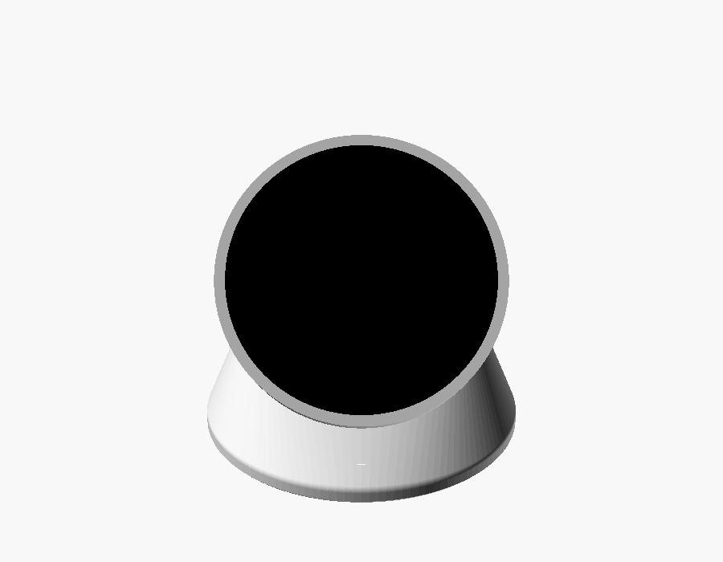
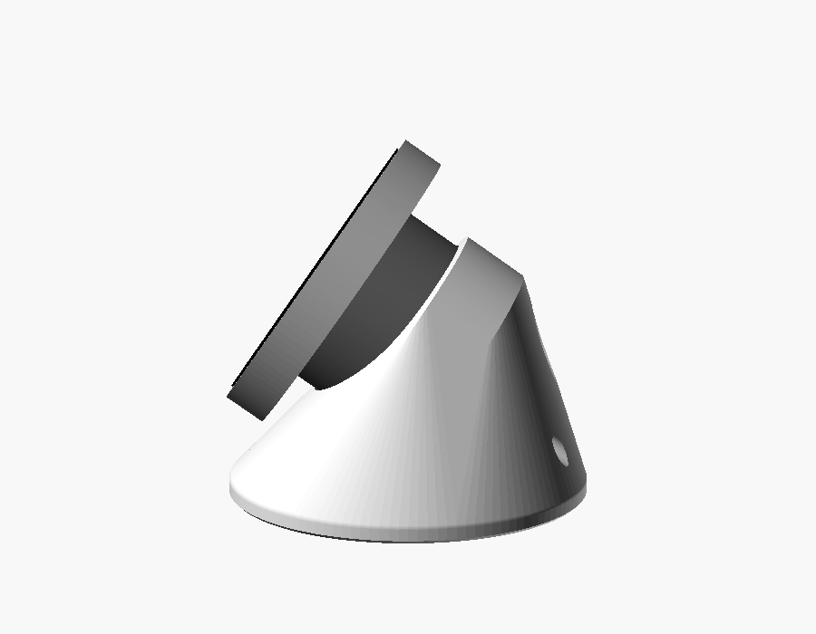
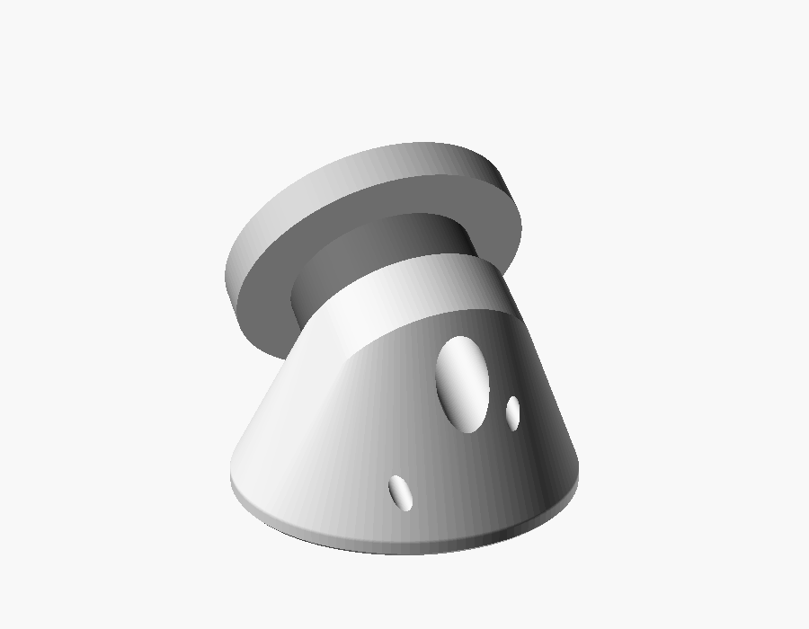
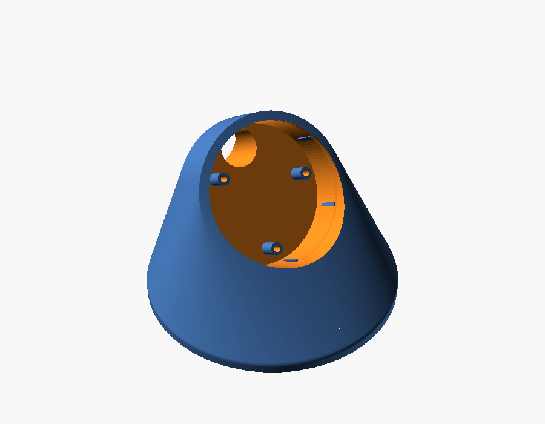
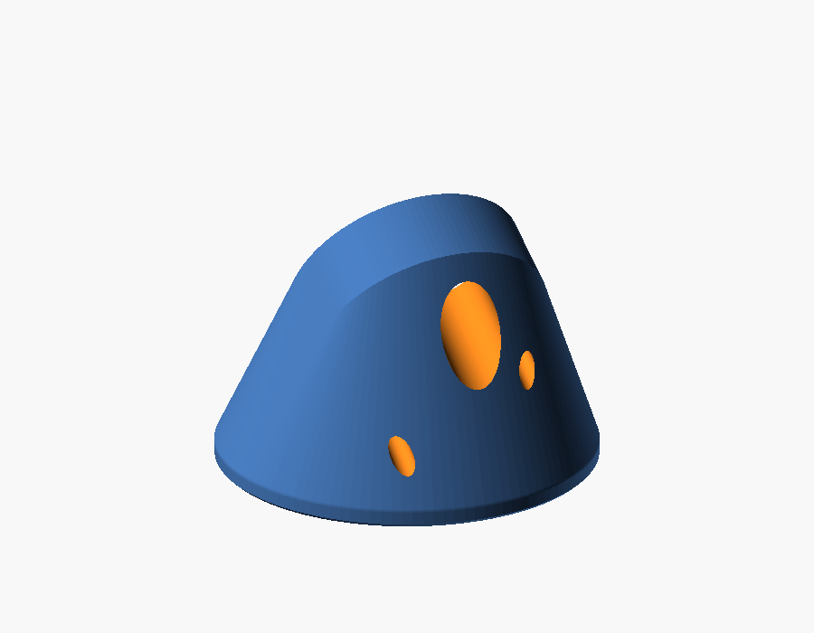
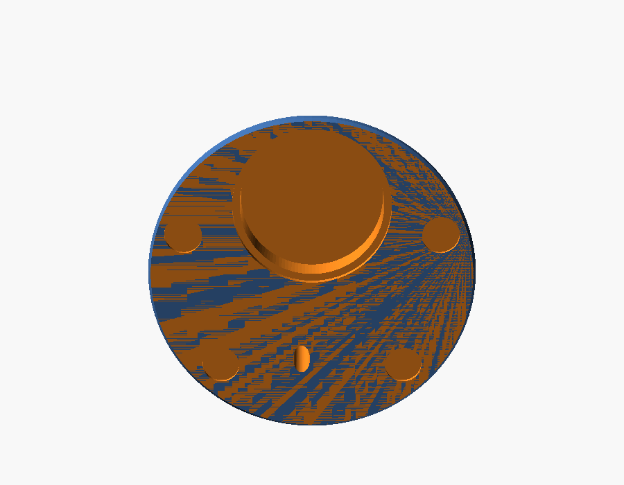

# Sockel für den Couchtisch

Parametrischer 3D-Druck-Sockel (OpenSCAD) für die MaTouchSonos-Fernbedienung.

| Vom Sofa aus | Von der Seite | Von hinten |
|---|---|---|
|  |  |  |

| Aufnahme mit Säulen | Rückseite: Kabeltunnel + 2 Schraubenkanäle | Unterseite: Gewichtstasche, Füße, 3. Schraubenkanal |
|---|---|---|
|  |  |  |

**Idee:** Der Sockel hält nur den hinteren Körper des Geräts. Der Kopf mit Display und Drehring
**schwebt frei** darüber. Nichts berührt den Ring, und der Drückweg (2 mm) bleibt frei. Die Front ist
um 35° gegen die Senkrechte geneigt, damit sie vom Sofa aus gut lesbar ist. Das USB-C-Kabel kommt
von hinten durch einen Tunnel genau in Achsrichtung zur Buchse.

**Befestigung:** Drei längere M2-Schrauben ersetzen die drei Original-Schrauben der Platine. Sie gehen
von hinten bzw. unten durch Kanäle im Sockel und durch Säulen, deren Oberkante die Platine gegen die
Original-Dome drückt. Die Säulen bestimmen die Einstecktiefe, der Becherrand schwebt ~1 mm über dem
Boden. So bleibt die Platine immer fest eingespannt. Drehen am Ring und Kabelzug belasten die
USB-C-Buchse nicht, und Reibung ist nicht nötig: Die Quetschrippen zentrieren nur.

## Dateien

| Datei | Inhalt |
|---|---|
| `sockel.scad` | Modell. Alle Maße stehen oben als Parameter (auch im Customizer von OpenSCAD). |
| `stl/sockel.stl` | Sockel, 92 × 92 × 64 mm |
| `stl/deckel.stl` | Deckel für die Gewichtstasche im Boden |
| `stl/passtest.stl` | Nur die Aufnahme als 10 mm hoher Ring: **zuerst drucken**, um die Passung zu prüfen (~10 min) |
| `stl/*` | Mit den Standardwerten erzeugt. Nach dem Messen ggf. neu erzeugen (siehe unten). |
| `bilder/` | Ansichten (werden aus dem Modell erzeugt) |

## Drucken (Bambu Lab P1S)

| Einstellung | Wert |
|---|---|
| Material | **PETG matt** (robust) oder **PLA Matte** (schönste Oberfläche). Kein ABS: verzieht sich bei dieser Grundfläche leicht. |
| Platte | Texturierte PEI-Platte: gibt dem Boden eine schöne Struktur |
| Schichthöhe | 0,16 mm („0.16mm Optimal“). Die schräge Oberfläche wird damit glatt. |
| Wände | 3, Infill 15 % Gyroid |
| Stützen | **keine**. Standfläche nach unten, so wie die STL liegt. |
| Naht | „Hinten“, also auf der Kabelseite |

Der Tunnel und die Oberseite der Aufnahme sind innen leicht überhängend (etwa 40°). Das druckt der P1S
ohne Stützen, innen darf es etwas rau sein.

## Material

| Teil | Menge | Hinweis |
|---|---|---|
| Schraube M2 × 16, Linsen-/Flachkopf (Kopf-Ø ≤ 4,2 mm) | 3 | **Gleiche Gewindeart wie die Originalschrauben**: meist selbstschneidend für Kunststoff („PT“/„Kunststoffschraube“). Länge prüfen, siehe unten. |
| Schraubendreher PH0/PH1 mit langem, schlankem Schaft (≥ 80 mm, Ø ≤ 4 mm) | 1 | Die Kanäle sind bis zu ~70 mm lang |
| Silikonfüße Ø 10 mm (z. B. 3M Bumpon) | 4 | |
| Unterlegscheiben M20 (Ø 37 × 3 mm) | 2 | optional, Beschwerung |
| USB-C-Kabel mit **geradem** Stecker | 1 | Steckergehäuse ≤ 13 mm breit |

**Vor dem Drucken zwei Werte messen** (eine der drei Platinen-Schrauben herausdrehen):
- **`pcb_tiefe`:** Abstand vom Becherrand bis zur Platinenoberfläche (Standard 3,0 mm). Die Säulen
  müssen die Platine berühren. Wenn du unsicher bist, lieber 0,2 mm mehr eintragen.
- **Originalschraube:** Länge des Gewindes. `einschraub` = Länge − Platinenstärke (1,6 mm).
  Beim Standard (`einschraub` = 4) passt M2 × 16. Das Modell rechnet mit `schraube_l` und bricht ab,
  wenn der Schraubenkopf nicht im vollen Material läge.

## Zusammenbau

1. **Passtest:** `passtest.stl` drucken und das Gerät (hinterer Becher) hineinstecken. Es soll mit leichtem
   Druck hineingehen und halten, aber nicht klemmen. Anpassen über `spiel` bzw. `rippe` im Modell:
   - zu stramm → `rippe` kleiner (z. B. 0.3) oder `spiel` größer
   - zu locker → `rippe` größer (z. B. 0.7)
2. **Gewicht (optional):** 2 Stahl-Unterlegscheiben M20 (Ø 37 × 3 mm, ~25 g je Stück) in die Tasche im
   Boden legen, `deckel.stl` einkleben. Der Sockel steht auch ohne Gewicht, weil die Standfläche weit genug
   nach hinten reicht. Das Gewicht macht ihn beim kräftigen Drücken nur ruhiger. Die Tasche liegt vorn,
   weg von der WLAN-Antenne. Den RSSI-Wert im Log (`WLAN verbunden, … RSSI`) trotzdem einmal mit und
   ohne Gewicht vergleichen.
3. **Füße:** 4 selbstklebende Silikonfüße (Ø 10 mm, z. B. 3M Bumpon) in die Mulden kleben.
4. **Platinen-Schrauben lösen:** Die drei Original-Schrauben aus der Platine drehen. Die Platine bleibt
   durch die Steckverbinder in Position, aber nicht am Kabel ziehen.
5. **Gerät einsetzen:** so drehen, dass die USB-C-Buchse zum Kabeltunnel zeigt („oben“ am Display).
   Dann passen die drei Säulen genau unter die Platinenlöcher. Einschieben, bis die Platine auf den
   Säulen aufliegt.
6. **Verschrauben:** Die drei M2-Schrauben durch die Kanäle einsetzen, zwei hinten und einer von unten,
   und handfest anziehen. Nicht überdrehen, die Dome sind aus Kunststoff.
7. **Kabel:** Den USB-C-Stecker gerade von hinten durch den Tunnel schieben und einstecken.

## Wichtige Parameter

| Parameter | Standard | Bedeutung |
|---|---|---|
| `neigung` | 35 | Displayfläche gegen die Senkrechte (0 = senkrecht, 90 = liegend). Vom Sofa: 30–40. |
| `griff` | 10 | So tief steckt der Körper im Sockel. Nur der hintere Becher, die Fuge bleibt frei. |
| `schwebe` | 16 | Abstand der untersten Kopfkante zum Tisch |
| `spiel`, `rippe` | 0.35, 0.5 | Passung der Aufnahme (siehe Passtest) |
| `usb_abstand` | 17.9 | Lage der USB-C-Buchse neben der Körpermitte (aus der Platinendatei von Makerfabs) |
| `pcb_tiefe` | 3.0 | Becherrand → Platinenoberfläche. **Messen!** |
| `schraube_l`, `einschraub` | 16, 4 | Schraubenlänge und Gewindelänge im Original-Dom |
| `loecher` | – | Lage der drei Platinenlöcher (aus der Eagle-Datei, auf die Vorderansicht gespiegelt) |
| `fuss_d` | 92 | Durchmesser der Standfläche |

Die Standfläche rückt automatisch so weit nach hinten, dass ein Druck auf die Displaymitte den Sockel
nicht nach hinten kippt: Die Hinterkante liegt mindestens 85 % von `Höhe der Displaymitte / tan(neigung)`
hinter der Displaymitte.

STL neu erzeugen:
```bash
openscad -o stl/sockel.stl   -D 'teil="sockel"'   sockel.scad
openscad -o stl/deckel.stl   -D 'teil="deckel"'   sockel.scad
openscad -o stl/passtest.stl -D 'teil="passtest"' sockel.scad
```

## Maßgrundlage

- Makerfabs-Zeichnung: Kopf Ø 79 ± 0,3 × 11,3, Körper Ø 50 ± 0,3 × 26, Drückweg 2
- Platinendatei (Eagle, [Makerfabs GitHub](https://github.com/Makerfabs/MaTouch-ESP32-S3-Rotary-IPS-Display-with-Touch-2.1-ST7701)):
  Platine Ø 43,5, USB-C senkrecht bestückt, 17,9 mm neben der Mitte; drei Befestigungslöcher M2
- Fotos vom Gerät: Rückseite offen (Platine im Becher, 3 Schrauben), USB-C zeigt axial nach hinten
