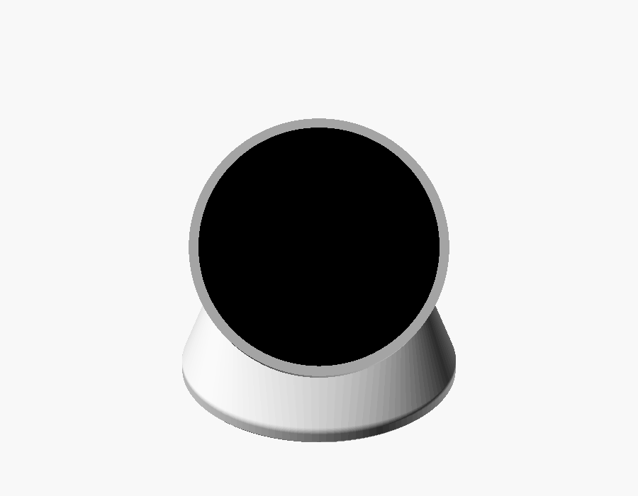
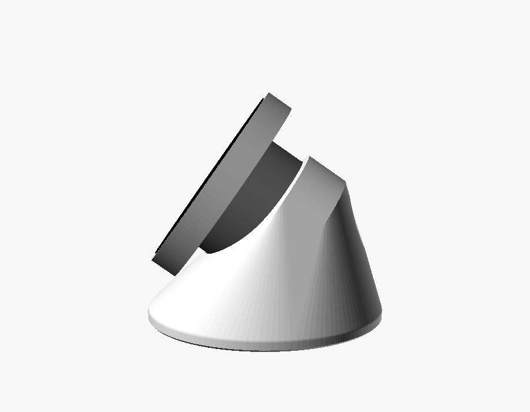
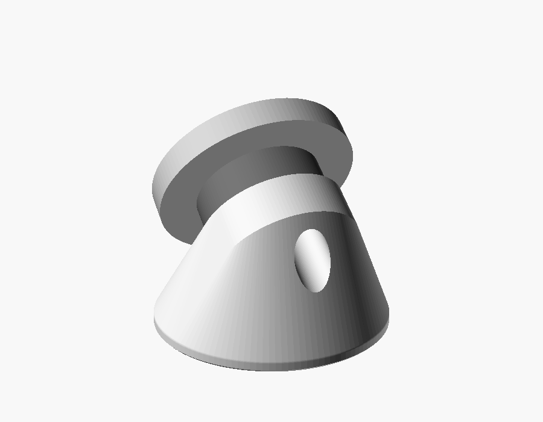
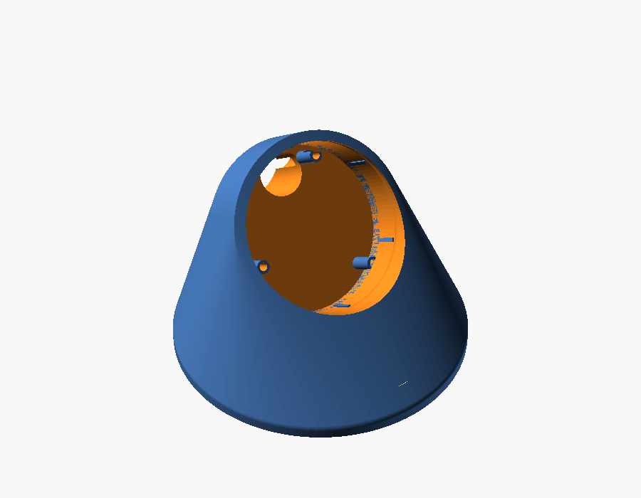
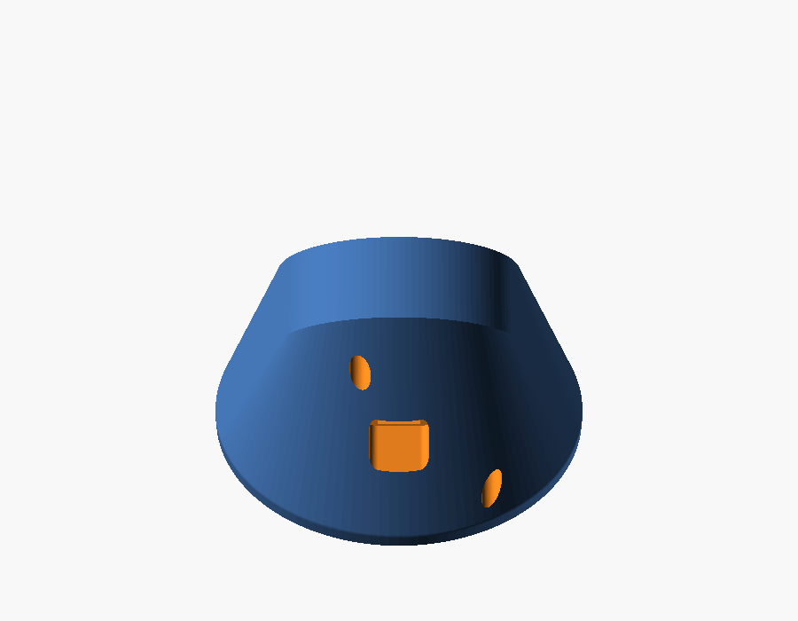
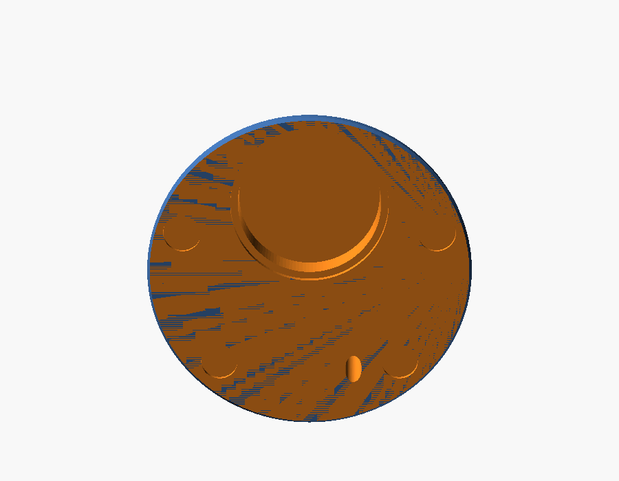

# Sockel für den Couchtisch

Parametrischer 3D-Druck-Sockel (OpenSCAD) für die MaTouchSonos-Fernbedienung.

| Vom Sofa aus | Von der Seite | Von hinten |
|---|---|---|
|  |  |  |

| Aufnahme mit Säulen | Rückseite: USB-C-Buchse + 2 Schraubenkanäle | Unterseite: Gewichtstasche, Füße, 3. Schraubenkanal |
|---|---|---|
|  |  |  |

**Idee:** Der Sockel hält nur den hinteren Körper des Geräts. Der Kopf mit Display und Drehring
**schwebt frei** darüber. Nichts berührt den Ring, und der Drückweg (2 mm) bleibt frei. Die Front ist
um 35° gegen die Senkrechte geneigt, damit sie vom Sofa aus gut lesbar ist. Das USB-C-Kabel steckt
hinten unten **im Sockel**: Eine kleine USB-C-Buchsenplatine sitzt eingeklebt in einem Schacht und ist
mit vier dünnen Drähten mit dem Gerät verbunden (die Buchse auf der Geräteplatine ist abgebrochen, siehe
unten). Zug am Kabel erreicht das Gerät nicht.

**Befestigung:** Das Gerätegehäuse hat drei eigene Schraubdome. Sie liegen in den Aussparungen am Rand
der Platine und sind leer. Drei M2-Schrauben gehen von hinten bzw. unten durch Kanäle im Sockel und durch
Säulen, die auf diesen Domen aufliegen, und greifen in die Dome. Die Platine bleibt mit ihren
Original-Schrauben, wie sie ist. Bezugsfläche ist das Gehäuse, nicht die Platine (die sitzt nicht
unbedingt gerade). Die Säulen bestimmen die Einstecktiefe, der Becherrand schwebt ~1 mm über dem Boden.
Drehen am Ring und Kabelzug belasten die USB-C-Buchse nicht, und Reibung ist nicht nötig: Die
Quetschrippen zentrieren nur.

## Dateien

| Datei | Inhalt |
|---|---|
| `sockel.scad` | Modell. Alle Maße stehen oben als Parameter (auch im Customizer von OpenSCAD). |
| `stl/sockel.stl` | Sockel, 92 × 92 × 64 mm |
| `stl/deckel.stl` | Deckel für die Gewichtstasche im Boden |
| `stl/passtest.stl` | Nur die Aufnahme als 10 mm hoher Ring: **zuerst drucken**, um die Passung zu prüfen (~10 min) |
| `stl/schablone.stl` | Kappe mit den drei Dom-Löchern: prüft die Lage der Dome (~5 min), siehe unten |
| `stl/*` | Mit den Standardwerten erzeugt. Nach dem Messen ggf. neu erzeugen (siehe unten). |
| `bilder/` | Ansichten (werden aus dem Modell erzeugt) |

## Drucken (Bambu Lab P1S)

| Einstellung | Wert |
|---|---|
| Material | **PETG matt** (robust) oder **PLA Matte** (schönste Oberfläche). Kein ABS: verzieht sich bei dieser Grundfläche leicht. |
| Platte | Texturierte PEI-Platte: gibt dem Boden eine schöne Struktur |
| Schichthöhe | 0,16 mm („0.16mm Optimal“). Die schräge Oberfläche wird damit glatt. |
| Wände | 3, Infill 15 % Gyroid |
| Stützen | **keine**. Standfläche nach unten, so wie die STL liegt. |
| Naht | „Hinten“, also auf der Kabelseite |

Der Tunnel und die Oberseite der Aufnahme sind innen leicht überhängend (etwa 40°). Das druckt der P1S
ohne Stützen, innen darf es etwas rau sein.

## Material

| Teil | Menge | Hinweis |
|---|---|---|
| Schraube M2 × 12, Linsen-/Flachkopf (Kopf-Ø ≤ 4,2 mm) | 3 | Selbstschneidend für Kunststoff („PT“/„Kunststoffschraube“), passend zum Loch in den Domen (siehe unten). |
| Schraubendreher PH0/PH1 mit langem, schlankem Schaft (≥ 80 mm, Ø ≤ 4 mm) | 1 | Die Kanäle sind bis zu ~70 mm lang |
| Silikonfüße Ø 10 mm (z. B. 3M Bumpon) | 4 | |
| Unterlegscheiben M20 (Ø 37 × 3 mm) | 2 | optional, Beschwerung |
| USB-C-Kabel mit **geradem** Stecker | 1 | Steckergehäuse ≤ 13 mm breit |

**Vor dem Drucken messen** (Rückseite offen, Schieblehre):
- **`dom_tiefe`:** Abstand vom Becherrand bis zur Oberkante der drei leeren Gehäuse-Dome (in den
  Aussparungen der Platine). Gemessen: Die Dome enden auf der Ebene des Innenrands, also 1,2 mm.
  Die Säulen müssen aufliegen; bei einem anderen Gerät lieber 0,2 mm mehr eintragen.
- **Becher innen:** ganz am Rand Ø 48 mm auf 1,2 mm Tiefe (`becher_rand_d`, `becher_rand_t`, gemessen),
  darunter enger (`becher_innen_d`, aus dem Foto ~46 mm). Die Säulen werden zur Wand hin abgeflacht,
  damit sie nicht anstoßen.
- **Loch in den Domen:** Ø 1,8 mm (gemessen), passt für selbstschneidende M2-Schrauben. Die Tiefe mit einem
  Zahnstocher messen: bis zum Grund einstecken, an der Domoberkante markieren, Stück nachmessen.
  `einschraub` (Standard 4) = so tief soll die Schraube in den Dom greifen, höchstens Lochtiefe − 0,5.
  Das Modell rechnet mit `schraube_l` und bricht ab, wenn der Schraubenkopf nicht im vollen Material läge.

**Lage der Dome prüfen:** Die Lage (`dome_r`, `dome_w`) stammt aus einem Flachbett-Scan der Rückseite:
gleichseitiges Dreieck, 37,1 mm Seitenlänge, Radius 21,43 mm, je 120°. Die Drehlage ist auf etwa ±1,5° genau. Deshalb zuerst `schablone.stl` drucken (~5 min), mit dem Kragen über das hintere Ende des
Körpers schieben, den Ausschnitt über die USB-C-Buchse. Eine M2-Schraube muss durch jedes der drei
Löcher senkrecht in den Dom fallen. Wenn ein Loch daneben liegt: Richtung und ungefähren Versatz notieren
und `dome_w` anpassen (Winkel in Grad, Blick von vorn, Buchse bei 90°; alle drei drehen sich mit).

## Zusammenbau

1. **Passtest:** `passtest.stl` drucken und das Gerät (hinterer Becher) hineinstecken. Es soll mit leichtem
   Druck hineingehen und halten, aber nicht klemmen. Anpassen über `spiel` bzw. `rippe` im Modell:
   - zu stramm → `rippe` kleiner (z. B. 0.3) oder `spiel` größer
   - zu locker → `rippe` größer (z. B. 0.7)
2. **Gewicht (optional):** 2 Stahl-Unterlegscheiben M20 (Ø 37 × 3 mm, ~25 g je Stück) in die Tasche im
   Boden legen, `deckel.stl` einkleben. Der Sockel steht auch ohne Gewicht, weil die Standfläche weit genug
   nach hinten reicht. Das Gewicht macht ihn beim kräftigen Drücken nur ruhiger. Die Tasche liegt vorn,
   weg von der WLAN-Antenne. Den RSSI-Wert im Log (`WLAN verbunden, … RSSI`) trotzdem einmal mit und
   ohne Gewicht vergleichen.
3. **Füße:** 4 selbstklebende Silikonfüße (Ø 10 mm, z. B. 3M Bumpon) in die Mulden kleben.
4. **Gerät einsetzen:** so drehen, dass die Stelle der alten USB-C-Buchse zum Schacht zeigt („oben“ am
   Display). Dann passen die drei Säulen genau durch die Aussparungen der Platine auf die Gehäuse-Dome. Einschieben,
   bis die Dome auf den Säulen aufliegen. Die Platinen-Schrauben bleiben drin.
5. **Verschrauben:** Die drei M2-Schrauben durch die Kanäle einsetzen, zwei hinten und einer von unten,
   und handfest anziehen. Nicht überdrehen, die Dome sind aus Kunststoff.
6. **Kabel:** Einstecken – fertig.

## USB-C-Buchse im Sockel

Die USB-C-Buchse auf der Geräteplatine ist abgebrochen. Ersatz ist eine Buchsenplatine
„USB3.1 Type C Female Testboard“ (12,7 × 21,6 mm, 6 Pins: VBUS, GND, CC1, CC2, D+, D−, mit 5,1-kΩ an CC),
verbunden über vier dünne Drähte (~8 cm):

| Buchsenplatine | Geräteplatine |
|---|---|
| VBUS | C16, 5-V-Seite (oberes Ende, zum Regler „JL309“ hin) |
| GND | C16, andere Seite, oder ein Langloch der alten Buchse |
| D+ | R21 (33 Ω unter dem ESP32) |
| D− | R20 (daneben) |

CC1/CC2 bleiben frei (die Widerstände sitzen auf der Buchsenplatine).

**Einbau** (vor Schritt 4 oben):
1. Die Buchsenplatine **von innen** (aus dem Hohlraum hinter dem Gerät) in den Schacht schieben, Buchse
   voran und zur Gerätemitte hin, bis sie an der Wand anliegt und die Buchse hinten in der Mulde sitzt.
   Falls die Drähte schon angelötet sind: Platine samt Drähten von innen einfädeln.
2. Mit **2K-Kleber** (Epoxid) oder reichlich Heißkleber im Schacht festkleben. Der Kleber hält beim
   Einstecken und Abziehen; die dünne Wand vor der Platine dient nur als Anschlag.
3. Die Drähte als lockere Schlaufe in den Hohlraum hinter dem Gerät legen (5 mm tief), **nicht** an der
   linken Seite (Blick von vorn) entlang: Dort liegt die WLAN-Antenne der Platine.

Parameter: `platine_l`, `platine_b`, `platine_d`, `buchse_b`, `buchse_h`, `buchse_ueber` (Überstand der
Buchse über die Platinenkante – bitte nachmessen), `schacht_y` (Lage des Schachts).

## Wichtige Parameter

| Parameter | Standard | Bedeutung |
|---|---|---|
| `neigung` | 35 | Displayfläche gegen die Senkrechte (0 = senkrecht, 90 = liegend). Vom Sofa: 30–40. |
| `griff` | 10 | So tief steckt der Körper im Sockel. Nur der hintere Becher, die Fuge bleibt frei. |
| `schwebe` | 16 | Abstand der untersten Kopfkante zum Tisch |
| `spiel`, `rippe` | 0.35, 0.5 | Passung der Aufnahme (siehe Passtest) |
| `usb_abstand` | 17.9 | Lage der USB-C-Buchse neben der Körpermitte (aus der Platinendatei von Makerfabs) |
| `dom_tiefe` | 1.2 | Becherrand → Oberkante der Gehäuse-Dome (gemessen) |
| `becher_rand_d`, `becher_rand_t` | 48, 1.2 | Innen-Ø und Tiefe des Randes ganz oben im Becher (gemessen) |
| `becher_innen_d` | 46 | Innen-Ø darunter, an den Domen (aus dem Foto) |
| `schraube_l`, `einschraub` | 12, 4 | Schraubenlänge und wie tief sie in den Dom greift |
| `dome_r`, `dome_w` | 21.43, 66.5 | Lage der drei Gehäuse-Dome (Radius, Winkel des ersten; je 120°; aus dem Scan) |
| `fuss_d` | 92 | Durchmesser der Standfläche |

Die Standfläche rückt automatisch so weit nach hinten, dass ein Druck auf die Displaymitte den Sockel
nicht nach hinten kippt: Die Hinterkante liegt mindestens 85 % von `Höhe der Displaymitte / tan(neigung)`
hinter der Displaymitte.

STL neu erzeugen:
```bash
openscad -o stl/sockel.stl   -D 'teil="sockel"'   sockel.scad
openscad -o stl/deckel.stl   -D 'teil="deckel"'   sockel.scad
openscad -o stl/passtest.stl -D 'teil="passtest"' sockel.scad
openscad -o stl/schablone.stl -D 'teil="schablone"' sockel.scad
```

## Maßgrundlage

- Makerfabs-Zeichnung: Kopf Ø 79 ± 0,3 × 11,3, Körper Ø 50 ± 0,3 × 26, Drückweg 2
- Platinendatei (Eagle, [Makerfabs GitHub](https://github.com/Makerfabs/MaTouch-ESP32-S3-Rotary-IPS-Display-with-Touch-2.1-ST7701)):
  Platine Ø 43,5, USB-C senkrecht bestückt, 17,9 mm neben der Mitte
- Fotos vom Gerät: Rückseite offen (Platine im Becher mit 3 Schrauben, daneben in Aussparungen der
  Platine 3 leere Gehäuse-Dome), USB-C zeigt axial nach hinten.
- Flachbett-Scan der Rückseite (1200 dpi, Lochränder mit Lackstift markiert): Lage der Dome; Drehlage
  über die drei Platinenlöcher im selben Scan (passen zu den Eagle-Koordinaten auf ~0,7 mm).
